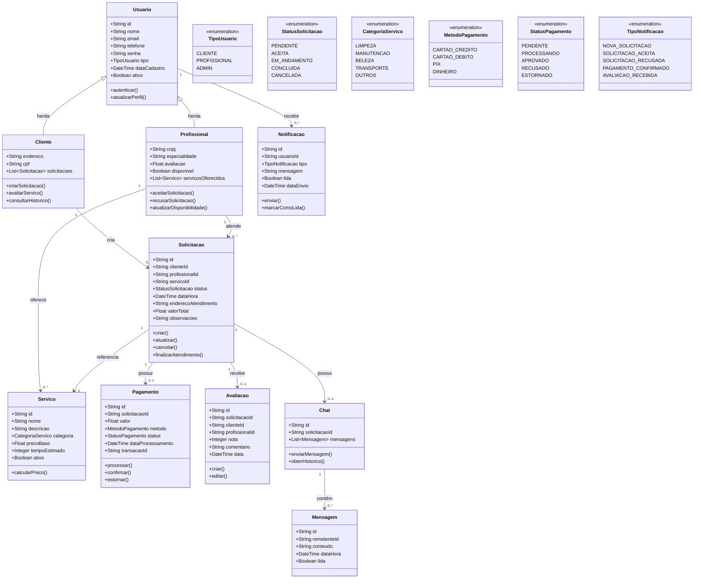

# 📊 Diagrama de Classes do Domínio - Desenrola

## Visão Geral

Este diagrama representa as principais entidades do domínio do sistema Desenrola e seus relacionamentos.

## Diagrama de Classes

## Descrição das Classes Principais

### Usuario (Classe Base)
Classe abstrata que representa qualquer usuário do sistema. Contém atributos e métodos comuns a todos os tipos de usuário.

### Cliente
Herda de Usuario. Representa os usuários que solicitam serviços. Pode criar solicitações, avaliar profissionais e consultar histórico.

### Profissional
Herda de Usuario. Representa os prestadores de serviço. Pode aceitar/recusar solicitações e gerenciar sua disponibilidade.

### Solicitacao
Entidade central do sistema. Representa uma requisição de serviço feita por um cliente e que será atendida por um profissional.

### Servico
Representa os tipos de serviços oferecidos na plataforma (limpeza, manutenção, etc.).

### Pagamento
Gerencia as transações financeiras relacionadas às solicitações.

### Avaliacao
Permite que clientes avaliem os serviços prestados pelos profissionais.

### Chat e Mensagem
Implementam o sistema de comunicação em tempo real entre cliente e profissional.

### Notificacao
Gerencia as notificações enviadas aos usuários sobre eventos importantes.

## Regras de Negócio Principais

1. **Solicitação**: Um cliente só pode criar uma solicitação se estiver autenticado
2. **Aceitação**: Um profissional só pode aceitar solicitações se estiver disponível
3. **Pagamento**: O pagamento só pode ser processado após a solicitação ser aceita
4. **Avaliação**: Só pode ser criada após a conclusão do serviço
5. **Chat**: Só é ativado após a solicitação ser aceita pelo profissional

## Padrões Aplicados

- **Herança**: Usuario → Cliente/Profissional
- **Composição**: Solicitacao contém Pagamento, Avaliacao, Chat
- **Agregação**: Chat contém Mensagens
- **Enumerações**: Para garantir valores válidos em status e tipos
